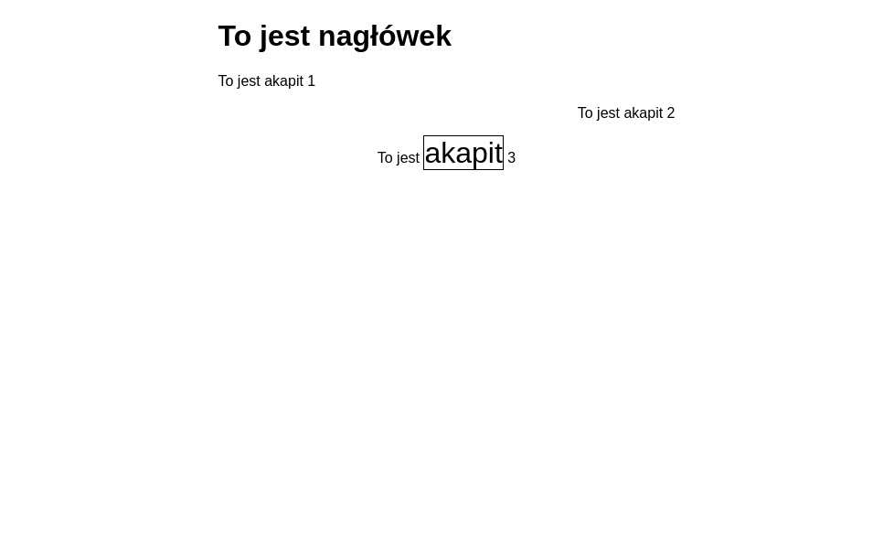
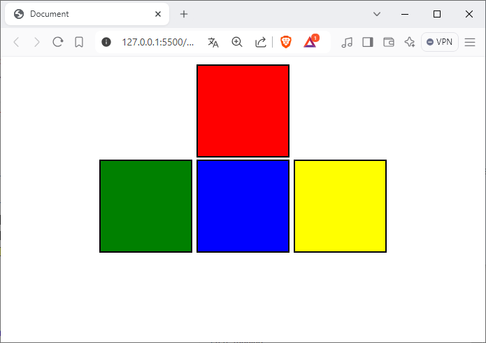

# PITSI303-hierarchy


### 1. SUPERSCRIPT/SUBSCRIPTS

<sub>1</sub>2<sup>3</sup>

### 2. LISTS

li, ul, ol, dl

### 3. TABLES

table, tbody, tr, td / th

### 4. CSS - kaskadowość, grupowanie, dziedziczenie

### 5. ZADANIA

#### ZAD30301 Wężykiem

#### ZAD30302 Lists






<!--
```html
<!DOCTYPE html>
<html lang="en">
<head>
    <meta charset="UTF-8">
    <meta name="viewport" content="width=device-width, initial-scale=1.0">
    <title>Document</title>
    <style>
        body{margin:0;font-family: Arial, Helvetica, sans-serif;}
        #face{
            width:40px;
            border-radius:50%;
        }
        nav{
            width:100%;
            background:grey;
            float:left;
            height: 48px;
            position:fixed;
            top:0;
        }
        #logo{float:left;margin-top:10px;margin-left:5px;}
        .avatar{float:right;margin:5px;}
        ul{float:left;list-style:none;}
        li{float:left;margin-left:10px;}
        section{
            margin:20px;
            text-align:justify;
        }
        a{
            text-decoration:none;
            color:white;
        }
        html{scroll-behavior: smooth;}
    </style>
</head>
<body>
    <nav>
       <div id="logo" style="padding:5px; background:brown;color:white; width:100px; text-align:center; border-radius:10px;">Logo</div>
       <ul>
            <li><a href="#s1">Pierwszy</a></li>
            <li><a href="#s2">Drugi</a></li>
            <li><a href="scroll.html#s3">Trzeci</a></li>
       </ul>
    <div class="avatar">
        
    </div>
    </nav>
    <section id="s1" style="padding-top:50px">
        <h3>Pierwszy</h3>
        Lorem ipsum dolor sit amet consectetur adipisicing elit. Molestiae sapiente nam id in itaque natus eaque magni distinctio corrupti, laudantium officia voluptate architecto voluptates sit eos minus laborum suscipit, perspiciatis quam. Praesentium omnis fuga beatae tempora dolorem corrupti similique quos. Ea autem porro ipsam, veritatis quis quas tenetur, vero voluptatem incidunt voluptates distinctio? Sed, quasi. Consectetur ipsum ex facere magni fugit sequi non dolor, laudantium illum esse quae amet vel suscipit aliquid pariatur velit sunt cum accusantium. Provident nobis ipsam temporibus eveniet quibusdam ex nemo, ea, magni <span id="s2"></span> exercitationem non tempora voluptate facere mollitia qui reprehenderit quisquam laudantium neque consequatur minima!
    
    </section>
    <section>
        <h3>Drugi</h3>
        Lorem ipsum dolor sit amet consectetur adipisicing elit. Molestiae sapiente nam id in itaque natus eaque magni distinctio corrupti, laudantium officia voluptate architecto voluptates sit eos minus laborum suscipit, perspiciatis quam. Praesentium omnis fuga beatae tempora dolorem corrupti similique quos. Ea autem porro ipsam, veritatis quis quas tenetur, vero voluptatem incidunt voluptates distinctio? Sed, quasi. Consectetur ipsum ex facere magni fugit sequi non dolor, laudantium illum esse quae amet vel suscipit aliquid pariatur velit sunt cum accusantium. Provident nobis ipsam temporibus eveniet quibusdam ex nemo, ea, magni exercitationem non tempora voluptate facere mollitia qui reprehenderit quisquam laudantium neque consequatur minima!
    </section>
    <section id="s3">
        <h3>Trzeci</h3>
        Lorem ipsum dolor sit amet consectetur adipisicing elit. Molestiae sapiente nam id in itaque natus eaque magni distinctio corrupti, laudantium officia voluptate architecto voluptates sit eos minus laborum suscipit, perspiciatis quam. Praesentium omnis fuga beatae tempora dolorem corrupti similique quos. Ea autem porro ipsam, veritatis quis quas tenetur, vero voluptatem incidunt voluptates distinctio? Sed, quasi. Consectetur ipsum ex facere magni fugit sequi non dolor, laudantium illum esse quae amet vel suscipit aliquid pariatur velit sunt cum accusantium. Provident nobis ipsam temporibus eveniet quibusdam ex nemo, ea, magni exercitationem non tempora voluptate facere mollitia qui reprehenderit quisquam laudantium neque consequatur minima!
    </section>
</body>
</html>
```
-->

